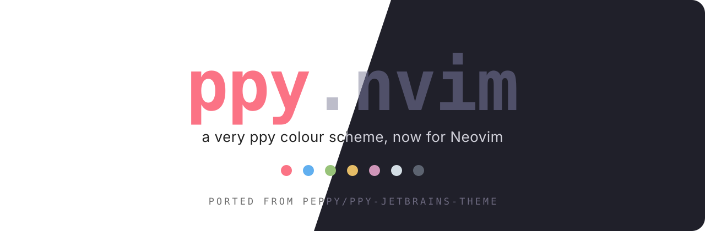
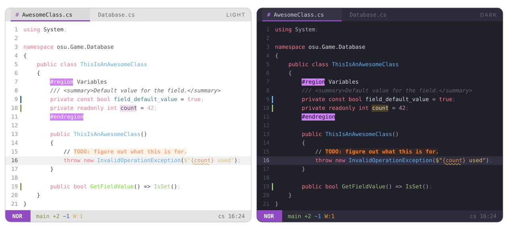

<p align="center">
  
</p>

<p align="center">
  <b>A very ppy colour scheme, now for Neovim.</b><br>
  A port of <a href="https://github.com/peppy">Dean Herbert</a>'s
  <a href="https://github.com/peppy/ppy-jetbrains-theme">ppy JetBrains theme</a>.
</p>

<p align="center">
  
  
  
</p>

---

<p align="center">
  
</p>

## About

[ppy-jetbrains-theme](https://github.com/peppy/ppy-jetbrains-theme) is the
colour scheme **Dean Herbert** ([@peppy](https://github.com/peppy), creator of
osu!) uses in Rider. He started it in Visual Studio about ten years ago and has
adapted it to his own needs since. The UI uses JetBrains Dark Purple, and the
syntax colour schemes are where the look comes from.

**ppy.nvim** brings it to Neovim. The syntax colors are taken from the
original `ppy Dark.xml` and `ppy Light.xml` editor schemes without changes, and
the UI colors from the theme's Dark Purple chrome:

| Role | Color | JetBrains key |
| --- | --- | --- |
| Keywords, `bool`/`int`, `true`/`null` | pink `#fb7385` | `DEFAULT_KEYWORD` |
| Types, classes, constructors | blue `#61afef` | `DEFAULT_CLASS_NAME` |
| Interfaces · enums | `#379aef` · `#269cef` | `DEFAULT_INTERFACE_NAME` · `ENUM_IDENTIFIER` |
| Function calls · declarations | green `#98c379` · light `#70e021` | `DEFAULT_FUNCTION_*` |
| Strings · format items | yellow `#e5bc66` · orange `#e58f44` | `DEFAULT_STRING` · `FORMAT_STRING_ITEM` |
| Numbers | magenta `#ce95b8` | `DEFAULT_NUMBER` |
| Comments | grey, italic | `DEFAULT_LINE_COMMENT` |
| Semicolons | faded (`#505069` / `#bdbdca`) | `DEFAULT_SEMICOLON` |
| `#region`, macros, directives | purple block `#d080fb` | `PREPROCESSOR_KEYWORD` |
| `TODO` | orange bold block | `TODO_DEFAULT_ATTRIBUTES` |
| Markdown headers | blue on a tinted band | `MARKDOWN_HEADER_LEVEL_*` |
| Errors · warnings · hints | wave on a tint · wave · dotted lime | `ERRORS_` / `WARNING_ATTRIBUTES` · `HINT` |

> [!NOTE]
> The light variant keeps the original colors, and several of them are low
> contrast on white (strings `#e5bc66` are 1.8:1). That is how the JetBrains
> theme looks. `scripts/contrast.lua` prints every ratio. To change a color,
> see [Examples](#examples).

## Features

- Two variants, `light` and `dark`, plus `ppy`, which follows `'background'`.
  Neovim 0.10+ detects the terminal background (OSC 11), so the theme matches
  your terminal automatically.
- **Fast.** Highlights are compiled to stripped LuaJIT bytecode with integer
  colors. A cached load is a single `loadfile()` and runs in **about 4 ms**,
  roughly 2× faster than the built-in `habamax`. The cache is keyed by a hash
  of your config, so it never goes stale.
- **Semantic tokens where Rider makes distinctions**: interfaces, enums,
  static members, readonly variables, declarations vs calls, accessors.
- **Faded semicolons**, as in Rider. Small treesitter `;extends` queries give
  `;` its own capture in c, cpp, c_sharp, java, javascript, typescript, tsx,
  rust, go, css, scss and php. Commas and dots are left alone (see
  `:h ppy-semicolons`).
- Built for **Neovim 0.12**. It covers every group the default colorscheme defines,
  plus `OkMsg`, `StderrMsg`, `StdoutMsg`, `DiffTextAdd`, `PmenuMatch`, `PmenuBorder`,
  `PmenuShadow`, `ComplMatchIns`, `SnippetTabstop*`, `DiagnosticVirtualLines*`,
  `LspReferenceTarget`, treesitter captures and LSP semantic tokens.
- **Matching themes for other tools**, generated from the same palette:
  Ghostty, Kitty and Lazygit.

## Supported plugins

| Plugin | Notes |
| --- | --- |
| [blink.cmp](https://github.com/saghen/blink.cmp) | menu, docs, signature, ghost text, **colored kinds** (also `CmpItemKind*`) |
| [mini.icons](https://github.com/echasnovski/mini.icons) | real icon colors |
| [mini.pick](https://github.com/echasnovski/mini.pick) / [mini.extra](https://github.com/echasnovski/mini.extra) | |
| [mini.files](https://github.com/echasnovski/mini.files) | |
| [mini.tabline](https://github.com/echasnovski/mini.tabline) | JetBrains editor tabs with the purple underline |
| Custom statusline | ready-made `StMode*`, `StGit*`, `StError`… groups, see [below](#statusline) |
| [gitsigns.nvim](https://github.com/lewis6991/gitsigns.nvim) | signs, `numhl`, `linehl`, inline, preview, staged, blame |
| [dropbar.nvim](https://github.com/Bekaboo/dropbar.nvim) | kind icons colored like the completion menu |
| [grug-far.nvim](https://github.com/MagicDuck/grug-far.nvim) | |
| [mason.nvim](https://github.com/mason-org/mason.nvim) | |
| [lazy.nvim](https://github.com/folke/lazy.nvim) | |
| [nvim-treesitter](https://github.com/nvim-treesitter/nvim-treesitter) | captures incl. `@markup.*`, `@diff.*`, `@comment.todo` … |

## Installation

[lazy.nvim](https://github.com/folke/lazy.nvim):

```lua
{
  "amonteirom96/ppy.nvim",
  lazy = false,
  priority = 1000,
  build = ":PpyCompile",
  opts = {},
  config = function(_, opts)
    require("ppy").setup(opts)
    vim.cmd.colorscheme("ppy")
  end,
}
```

Native `vim.pack` (Neovim 0.12):

```lua
vim.pack.add({ "https://github.com/amonteirom96/ppy.nvim" })
require("ppy").setup({})
vim.cmd.colorscheme("ppy")
```

### Colorschemes

| Command | Behavior |
| --- | --- |
| `:colorscheme ppy` | follows `'background'` (or the `variant` option) |
| `:colorscheme ppy-light` | always light |
| `:colorscheme ppy-dark` | always dark |

## Configuration

Calling `setup()` is optional. These are the defaults:

```lua
require("ppy").setup({
  variant = "auto",          -- "auto" (follow 'background') | "light" | "dark"
  transparent = false,       -- no background on Normal, floats and the sign column
  terminal_colors = true,    -- set g:terminal_color_0..15
  dim_inactive = false,      -- slightly different background on unfocused windows
  dim_semicolons = true,     -- `;` in the faded semicolon tone, like Rider
  float = {
    solid = false,           -- filled floats with an invisible border
  },
  styles = {                 -- any nvim_set_hl attributes (bold, italic, underline…)
    comments = { italic = true },
    keywords = {},
    functions = {},
    variables = {},
    strings = {},
    types = {},
    constants = {},
    operators = {},
  },
  integrations = {           -- set to false to skip a plugin's groups
    blink = true,
    dropbar = true,
    gitsigns = true,
    grug_far = true,
    lazy = true,
    mason = true,
    mini = true,             -- icons, pick, extra, files, tabline
    semantic_tokens = true,
    statusline = true,       -- StMode*, StGit*, StError… for a hand-written statusline
    treesitter = true,
  },
  cache = true,              -- compile to bytecode (turn off only while hacking on the theme)

  --- Change the palette before any highlight is built.
  ---@param colors ppy.Colors
  ---@param variant "light"|"dark"
  on_colors = function(colors, variant) end,

  --- Add or change highlight groups.
  ---@param hl table<string, ppy.Style>
  ---@param colors ppy.Colors
  ---@param variant "light"|"dark"
  on_highlights = function(hl, colors, variant) end,
})
```

### Examples

**Bold keywords, no italic comments:**

```lua
require("ppy").setup({
  styles = { comments = {}, keywords = { bold = true } },
})
```

**Darker strings and types on the light variant** (for more contrast on white):

```lua
require("ppy").setup({
  on_colors = function(c, variant)
    if variant == "light" then
      c.code.string = "#a8791a"
      c.code.type = "#2f7fc4"
    end
  end,
})
```

**Brighter comments on the dark variant:**

```lua
require("ppy").setup({
  on_colors = function(c, variant)
    if variant == "dark" then
      c.code.comment = "#7f8796"
    end
  end,
})
```

### Statusline

Git and diagnostics already have their colors. Nothing to pick in `on_colors`:
gitsigns, diff, `Added`/`Changed`/`Removed` and lazygit all use
`c.git.{add,change,delete}` out of the box.

For a hand-written statusline, the theme also ships these groups, with the same
git and diagnostic colors (all on `ui.panel`):

| Group | Color |
| --- | --- |
| `StModeNormal` · `Insert` · `Visual` · `Replace` · `Command` · `Other` | Dark Purple · green · pink · orange · yellow · cyan (filled) |
| `StMode<Mode>Sep` | the mode color, for the powerline edge |
| `StGit` · `StGitAdd` · `StGitChange` · `StGitDelete` | git add · add · change · delete |
| `StError` · `StWarn` · `StInfo` · `StHint` | diagnostic colors |
| `StProject` · `StLsp` | `accent` |

```lua
local branch = vim.b.gitsigns_head
vim.o.statusline = "%#StModeNormal# NOR %#StModeNormalSep#%* %#StGit# " .. (branch or "") .. "%*"
```

Change any of them with `on_highlights`, or turn them off with
`integrations = { statusline = false }`.

## Palette

Code roles live in `c.code`, UI chrome in `c.ui`, and accents (git,
diagnostics, kinds, icons, terminal) at the top level:

| Key | Light | Dark | Used for |
| --- | --- | --- | --- |
| `bg` | `#ffffff` | `#20202a` | background |
| `fg` | `#383a3f` | `#abb2bf` | text, operators, brackets |
| `code.variable` | `#4f4f4f` | `#dcdcdc` | identifiers, fields, namespaces |
| `code.keyword` | `#fb7385` | `#fb7385` | keywords, builtin types, booleans |
| `code.type` | `#61afef` | `#61afef` | types, constructors |
| `code.func` · `func_decl` | `#98c379` · `#70e021` | `#98c379` | calls · declarations |
| `code.parameter` | `#23b5ff` | `#dcdcdc` | parameters |
| `code.constant` | `#3b7b9b` | `#d3dde4` | constants, readonly |
| `code.string` | `#e5bc66` | `#e5bc66` | strings |
| `code.number` | `#ce95b8` | `#ce95b8` | numbers |
| `code.comment` | `#939aa6` | `#5c6370` | comments (italic) |
| `code.semicolon` | `#bdbdca` | `#505069` | `;` |
| `ui.accent` | `#904ac2` | `#904ac2` | tab underline, Normal mode |
| `ui.selection` | `#e5deff` | `#40375e` | Visual |
| `red` | `#cc5450` | `#ff4e4e` | git delete, errors |
| `yellow` | `#d7ab54` | `#eda726` | warnings |
| `green` | `#71983b` | `#98c379` | git add, ok |
| `blue` | `#376388` | `#61afef` | git change, info |
| `purple` | `#904ac2` | `#d080fb` | modules, `accent` (dark) |

Every value is listed, with the JetBrains key it came from, in
[`lua/ppy/palette.lua`](lua/ppy/palette.lua).

Use the palette in your own config:

```lua
local c = require("ppy").colors()        -- current variant
local light = require("ppy").colors("light")
local groups = require("ppy").highlights("dark")
```

## Extras

Themes for other tools live in [`extras/`](extras). They are generated from the
palette and include your `on_colors` overrides when you regenerate them:

```vim
:PpyExtras [output-dir]
```

| Tool | Files | Setup |
| --- | --- | --- |
| **Ghostty** | `extras/ghostty/ppy-{light,dark}` | copy to `~/.config/ghostty/themes/`, then `theme = light:ppy-light,dark:ppy-dark` |
| **Kitty** | `extras/kitty/ppy-{light,dark}.conf` | copy them to `~/.config/kitty/light-theme.auto.conf` and `dark-theme.auto.conf` to follow the OS theme, or `include` one |
| **Lazygit** | `extras/lazygit/ppy-{light,dark}.yml` | `LG_CONFIG_FILE=~/.config/lazygit/config.yml,~/.config/lazygit/ppy-dark.yml` |

The light terminal palette uses the base/lighter ANSI pairs from the light
JetBrains theme (`$baseRed`/`$lighterRed`, …).

## Commands

| Command | Description |
| --- | --- |
| `:PpyCompile` | Rebuild the bytecode cache. Run it after updating the plugin, or after changing values captured inside an `on_*` closure. |
| `:PpyClearCache` | Delete the cache (`stdpath("cache")/ppy`). |
| `:PpyExtras [dir]` | Generate the Ghostty, Kitty and Lazygit themes. |

## Development

```sh
# contrast report (every accent and code role, both variants)
nvim --headless -u NONE --cmd "set rtp^=." -l scripts/contrast.lua
# smoke tests
nvim --headless -u NONE --cmd "set rtp^=." -l tests/smoke.lua
# load-time benchmark
nvim --headless -u NONE --cmd "set rtp^=." -l scripts/bench.lua
# regenerate extras and README images from the palette
nvim --headless -u NONE --cmd "set rtp^=." -c "lua require('ppy').extras()" -c q
nvim --headless -u NONE --cmd "set rtp^=." -l scripts/assets.lua
```

When you change highlight definitions, bump `M.version` in
`lua/ppy/init.lua`. This invalidates every user's compiled cache.

## Credits

- **[Dean Herbert (@peppy)](https://github.com/peppy)** made the colour scheme:
  [peppy/ppy-jetbrains-theme](https://github.com/peppy/ppy-jetbrains-theme)
  (MIT). All the syntax and UI colors come from his work.
- The plugin structure (compiled cache, integrations, extras) follows
  [essential.nvim](https://github.com/amonteirom96/essential.nvim).

## License

[MIT](LICENSE). The original colour scheme is © 2023 Dean Herbert, also under MIT.
